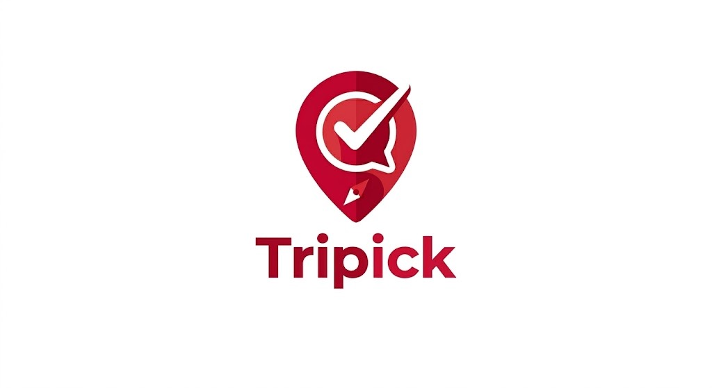

# SKN25-3rd-5Team

  

  # ✈️ Tripick : 당신의 여행지를 추천해드립니다

 < **데이터 기반의 개인 맞춤형 여행지 큐레이션 서비스** > 일반 관광지 정보부터 반려동물 동반, 무장애 시설 데이터까지 통합하여 모든 사용자를 위한 최적의 여행 경험을 설계합니다.

---

# 1. 팀 소개 (Team Introduction)

<table>
  <tr>
    <td align="center"></td>
    <td align="center"></td>
    <td align="center"></td>
    <td align="center"></td>
  </tr>
  <tr>
    <th align="center">박성진</th>
    <th align="center">이상민</th>
    <th align="center">이채림</th>
    <th align="center">임하영</th>
  </tr>
  <tr>
    <td align="center"><a href="https://github.com/acegikmoop-code">acegikmoop</a></td>
    <td align="center"><a href="https://github.com/Sangmin630">Sangmin630</a></td>
    <td align="center"><a href="https://github.com/chaechae18">chaechae18</a></td>
    <td align="center"><a href="https://github.com/pureunsaerok-ship-it">pureunsaerok</a></td>
  </tr>
  <tr>
    <th align="center"></th>
    <th align="center"></th>
    <th align="center"></th>
    <th align="center"></th>
  </tr>
</table>

---

# 2. 프로젝트 기간 (Project Period)

**Apr 06, 2026 - Apr 07, 2026**

---

# 3. 프로젝트 개요 (Project Overview)

## 🎯 프로젝트 배경 및 목적
* **정보의 파편화 해소:** 일반 관광지 정보와 반려동물, 무장애 시설 정보가 분산되어 있어 맞춤형 정보를 얻기 어려운 불편함을 개선하고자 합니다.
* **데이터 기반의 의사결정:** 실제 여행객의 이동 패턴이 담긴 설문 데이터를 분석하여, 단순한 장소 나열이 아닌 '실행 가능한' 여행 계획을 제안합니다.
* **보편적 여행권 보장:** 반려동물 양육 가구와 교통약자(휠체어/유모차 이용자) 등 다양한 사용자층이 제약 없이 여행을 즐길 수 있도록 정밀한 데이터를 제공하는 것이 목적입니다.

## 👥 대상 사용자 (Target Audience)
* **반려인 가구:** 반려동물과 함께 입장이 가능한 장소 및 편의시설 정보를 찾는 사용자
* **교통 약자 및 보호자:** 휠체어 접근성, 경사로 유무 등 무장애 관광 정보를 필요로 하는 사용자
* **맞춤형 여행 탐색자:** 본인의 여행 행태(동반자 유형, 이동수단 등)에 최적화된 관광지 큐레이션을 원하는 사용자

## ✨ 기대 효과 (Expected Effects)
* **여행 준비 시간 단축:** 파편화된 정보를 한곳에 모아 사용자별 맞춤형 추천을 제공함으로써 정보 검색의 피로도를 낮춥니다.
* **정보 격차 해소:** 반려동물 및 무장애 시설과 같은 특수 데이터를 활용해 소외되는 사용자층 없이 모두가 누릴 수 있는 여행 환경을 조성합니다.
* **정교한 추천 로직 구현:** 단순 키워드 검색을 넘어, 벡터 데이터화된 실제 여행 행태 기반의 시맨틱 매칭을 통해 추천 시스템의 신뢰도를 높입니다.

## 🛠 주요 사용 데이터셋 (Dataset)

본 프로젝트는 **한국관광공사(TourAPI)**와 **공공데이터포털**에서 제공하는 신뢰도 높은 데이터를 기반으로 구축되었습니다.

| 데이터 출처 | 주요 내용 |
| :--- | :--- |
| [한국문화관광연구원] 국민여행조사 통계 원자료 | 실질적인 여행 행태(이동수단, 동행인, 소비패턴 등) |
| [한국관광공사] 기초지자체 중심 관광지 정보 | 전국 관광지 명칭, 주소, 위경도 좌표(POI) 정보 |
| [한국관광공사] 반려동물 동반여행 서비스 정보 | 반려동물 동반 가능 여부 및 관련 편의시설 상세 정보 |
| [한국관광공사] 무장애 여행 정보 서비스 | 교통약자를 위한 물리적 접근성(경사로, 전용시설 등) |

---

# 4. 핵심 기능 (Key Features)

### 📍 개인화 필터 추천 (Smart Filtering)
- 사용자의 출발지, 이동 수단, 동행자 유형을 고려하여 최적의 목적지 TOP 3를 제안합니다.

### 🐾 맞춤형 테마 검색 (Specialized Search)
- **Pet-Friendly:** 반려동물과 함께 이용 가능한 식당, 카페, 숙소를 정확하게 매칭합니다.
- **Barrier-Free:** 휠체어 접근이 용이한 관광지 정보를 우선적으로 노출합니다.

### 🤖 LLM 기반 지능형 가이드
- 전처리된 4개의 데이터셋을 기반으로 LLM이 실시간 Q&A 및 여행 일정을 생성합니다.

---

# 5. 프로젝트 설계
### 프로젝트 구조
```
SKN25-3rd-5Team/
├── 📁 frontend/                   # Streamlit 기반 프론트엔드 서비스
│   ├── app.py                    # Streamlit 엔트리 포인트 (메인 실행 파일)
│   ├── style.css                 # 전역 스타일 시트
│   ├── 📁 assets/                # 정적 리소스 (로고, 아이콘 등)
│   │   └── logo.png              # 서비스 공식 로고
│   └── 📁 views/                 # 서비스 페이지별 모듈
│       ├── about.py              # 서비스 소개 및 팀 소개 페이지
│       ├── category.py           # 여행 테마/카테고리 선택 페이지
│       ├── chat.py               # RAG 기반 AI 챗봇 인터페이스
│       └── plan.py               # 개인 맞춤형 여행 일정 생성 페이지
│
├── 📁 backend/                   # 데이터 처리 및 AI 비즈니스 로직
│   ├── main.py                   # 백엔드 API 서버 및 서비스 컨트롤러
│   ├── loader.py                 # 초기 데이터 로드 및 환경 설정
│   ├── build_place_vectors.py    # 관광지 데이터 임베딩 생성/DB 적재 스크립트
│   ├── build_behavior_vectors.py # 사용자 행태 데이터 임베딩 생성/DB 적재 스크립트
│   ├── 📁 services/              # 핵심 엔진 모듈
│   │   ├── llm.py                # LLM 프롬프트 엔지니어링 및 모델 인터페이스
│   │   ├── rag.py                # Retrieval-Augmented Generation 통합 로직
│   │   └── retriever.py          # 벡터 유사도 검색 및 메타데이터 필터링 엔진
│   └── 📁 data/processed/        # 전처리 완료된 모델용 데이터 (Pickle)
│       ├── tourpoi.pkl           # 통합 관광지 POI 데이터
│       ├── pet_df_final.pkl      # 반려동물 특화 관광지 데이터
│       ├── barrier_free.pkl      # 무장애 관광 시설 데이터
│       └── tour_survey_final.pkl # 국민여행조사 사용자 행태 통계 데이터
│
├── 📁 prepare_notebook/          # 데이터 분석 및 전처리 실험실 (EDA)
│   ├── tour_db.ipynb             # 공공데이터 통합 및 정제 과정 기록
│   ├── tour_survey.ipynb         # 설문 데이터 분석 및 페르소나 추출 과정
│   └── 📁 data/                  # 로우 데이터 (원본)
│       ├── pet_tour_data.csv     # 반려동물 여행 원본
│       ├── sigungu_code.csv      # 시군구 행정 코드표
│       ├── 무장애.json            # 무장애 관광 정보 원본
│       └── 여행지.csv             # 전국 관광지 기초 정보
│
├──  Dockerfile                 # 서비스 컨테이너화를 위한 빌드 설정
├──  compose.yaml               # 멀티 컨테이너(App + DB) 오케스트레이션
├──  requirements.txt           # Python 라이브러리 의존성 목록
├──  .gitignore                 # Git 추적 제외 설정 (venv, .env 등)
└──  README.md                  # 프로젝트 통합 가이드 문서

'''
### ERD


# 6. 한 줄 회고

# 7. 기술 스택 (Tech Stack)
